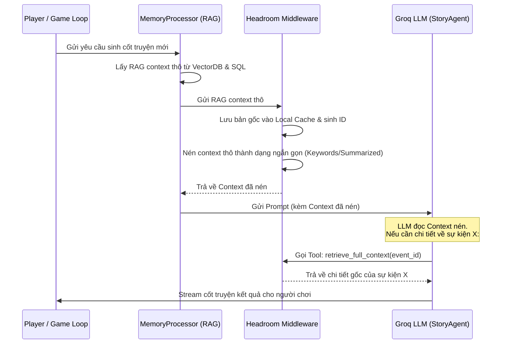

# Tài liệu Tích hợp Headroom tối ưu hóa Token cho AI-Adventure-Game

Tài liệu này phân tích các điểm nghẽn token hiện tại trong dự án **AI-Adventure-Game** và đề xuất giải pháp tích hợp **Headroom** (lớp tối ưu hóa ngữ cảnh) để giảm 60-95% lượng token tiêu thụ trên Groq API, tăng tốc độ phản hồi (giảm latency) và cải thiện hiệu năng của hệ thống RAG Lai (Hybrid RAG).

---

## 1. Phân tích điểm nghẽn Token hiện tại trong Game

Trong kiến trúc hiện hành của Game:
1. **RAG Context khổng lồ:** Hàm `get_rag_context` trong [MemoryManager.py](file:///d:/D/HOCTAP/TDTT/AI-Adventure-Game/engine/DataManager/MemoryManager.py#L58-L96) gom toàn bộ ký ức liên quan (`memories`), thông tin NPC (`npc_rows`) và thông tin địa điểm (`location_rows`) thành 3 khối văn bản thô dạng:
   - `[MEMORY RETRIEVAL]`
   - `[NPC RETRIEVAL]`
   - `[LOCATION RETRIEVAL]`
2. **Context Window của StoryAgent phình to nhanh chóng:** Ở mỗi lượt chơi, [StoryAgent](file:///d:/D/HOCTAP/TDTT/AI-Adventure-Game/engine/Agents/CloudAgents.py#L402-L467) phải nhận lại toàn bộ thông tin tĩnh (World Theme, Conflict, Vocabulary) kết hợp với các thông tin động thay đổi liên tục (RAG context, NPC context, Quest context, Lịch sử chat).
3. **Phá vỡ Prompt Caching:** Các thông tin như chỉ số nhân vật (máu, trang bị) thay đổi liên tục theo từng lượt làm prompt gửi lên LLM khác đi một chút, khiến cơ chế Prompt Caching của các API Provider (như Groq) không thể kích hoạt được, dẫn đến việc LLM phải xử lý lại toàn bộ prompt từ đầu gây tốn chi phí và thời gian.

---

## 2. Các ý tưởng tích hợp Headroom & Cách vận hành

### Ý tưởng 1: Áp dụng CCR (Compress-Cache-Retrieve) cho RAG Context
Thay vì gửi toàn bộ văn bản thô của Ký ức dài hạn, NPC và Địa điểm vào prompt, ta sẽ đi qua lớp nén của Headroom.

#### 💡 Chi tiết ý tưởng
* **Nén (Compress):** RAG Context thô sau khi truy xuất từ FAISS & SQLite sẽ được Headroom chuyển đổi thành dạng siêu nén (Ví dụ: Chỉ giữ lại các từ khóa cốt lõi hoặc mã hóa ID).
* **Lưu đệm (Cache):** Dữ liệu gốc đầy đủ của từng ký ức/NPC được lưu lại trong một bộ nhớ đệm cục bộ (Local Cache) của game, tương ứng với một mã định danh (ID).
* **Truy xuất ngược (Retrieve):** Khi `StoryAgent` phân tích cốt truyện, nếu nó thấy một từ khóa hoặc một sự kiện bị nén mà nó cần hiểu rõ chi tiết (ví dụ: chi tiết về một vật phẩm cổ xưa trong ký ức), LLM sẽ gọi một công cụ (Tool Call) có tên là `retrieve_full_context(context_id)` để lấy lại dữ liệu gốc.

#### ⚙️ Cách vận hành


---

### Ý tưởng 2: Ổn định Prompt (Prompt Stabilization) phục vụ Prompt Caching
Giúp tận dụng tối đa tính năng Prompt Caching của Groq để giảm tới 90% chi phí token nhập vào (input tokens).

#### 💡 Chi tiết ý tưởng
* Headroom sẽ chặn prompt trước khi gửi đi và tách prompt thành 2 phần rõ rệt: **Phần Tĩnh (Static)** và **Phần Động (Dynamic)**.
* **Phần Tĩnh** (World Bible, System Prompt, Luật lệ game) sẽ được chuẩn hóa để giống hệt nhau 100% giữa các lượt chơi.
* **Phần Động** (Máu của người chơi, lượt chơi hiện tại, câu lệnh vừa nhập) sẽ được Headroom chuyển xuống cuối cùng hoặc tách biệt hẳn để tránh làm mất hiệu lực cache của phần tĩnh nằm ở đầu.
* Loại bỏ các dao động nhỏ không ảnh hưởng đến quyết định cốt truyện lớn (ví dụ: thay vì ghi cụ thể `HP: 97/100`, Headroom có thể chuyển đổi thành trạng thái chung như `HP: Khỏe mạnh` để giữ prompt nhất quán).

#### ⚙️ Cách vận hành
Trong [BaseCloudAgent._chat](file:///d:/D/HOCTAP/TDTT/AI-Adventure-Game/engine/Agents/CloudAgents.py#L72-L101), ta tích hợp bộ lọc làm sạch/chuẩn hóa prompt của Headroom trước khi gọi API:

```python
# Minh họa tích hợp trong BaseCloudAgent
from headroom import PromptStabilizer

class BaseCloudAgent:
    def __init__(self, api_key: str, pm: PromptManager, model_name: str):
        self.client = AsyncGroq(api_key=api_key)
        self.model = model_name
        self.pm = pm
        # Khởi tạo bộ ổn định prompt của Headroom
        self.stabilizer = PromptStabilizer(
            mask_variables=["hp", "gold", "turn_count"], # Che đi các biến động nhỏ
            cache_friendly_order=True
        )

    async def _chat(self, messages: List[Dict[str, str]], ...):
        # 1. Ổn định hóa danh sách tin nhắn trước khi gửi để tăng tỉ lệ cache hit
        optimized_messages = self.stabilizer.optimize(messages)
        
        # 2. Gọi API với prompt đã tối ưu
        response = await self.client.chat.completions.create(
            model=self.model,
            messages=optimized_messages,
            ...
        )
        return response
```

---

### Ý tưởng 3: Nén đầu ra JSON (Structured Output Compression) cho các Agent Phụ
Các Agent như `NPCAgent`, `LocationAgent`, `ChoiceAgent` trả về dữ liệu có cấu trúc (JSON). Dữ liệu này thường chứa nhiều khoảng trắng, dấu ngoặc hoặc các mô tả dài dòng không cần thiết khi lưu trữ lại vào lịch sử hội thoại.

#### 💡 Chi tiết ý tưởng
* Headroom áp dụng thuật toán `SmartCrusher` để dẹp bỏ toàn bộ các trường (fields) trống, nén các từ khóa JSON thành dạng viết tắt khi lưu vào bộ nhớ lịch sử của Agent.
* Khi nạp lại các NPC hoặc Địa điểm cũ vào prompt lượt sau, thay vì nạp JSON thô đầy đủ, ta nạp phiên bản đã được nén cấu trúc.

#### ⚙️ Cách vận hành
Ví dụ về nén thông tin NPC trước khi nạp vào context của StoryAgent:

**Trước khi nén (JSON gốc - 150 tokens):**
```json
{
  "npcs": [
    {
      "id": 12,
      "name": "Eldrin",
      "personality": "Thận trọng, thông thái nhưng có phần khép kín",
      "description": "Một vị pháp sư già mặc áo choàng xám, tay cầm trượng gỗ có đính đá ma thuật phát sáng xanh lam nhẹ",
      "affectionate": 5,
      "location": "Thư viện Cổ",
      "status": "Đang đọc sách cổ và nghiên cứu về lời nguyền"
    }
  ]
}
```

**Sau khi đi qua Headroom SmartCrusher (Nén - 45 tokens):**
```text
NPC[12]: Eldrin | Lc: Thư viện Cổ | St: Đang đọc sách cổ | Ps: Thận trọng, thông thái | Aff: 5
```
*Headroom sẽ tự động map lại cấu trúc này thành Object đầy đủ ở local khi cần thiết mà không bắt LLM phải đọc toàn bộ các key JSON dư thừa.*

---

## 3. Bản kế hoạch hiện thực hóa (Implementation Blueprint)

Nếu tiến hành tích hợp, chúng ta sẽ thực hiện theo các bước sau:

1. **Cài đặt thư viện:** Cài đặt Headroom SDK vào môi trường ảo của dự án.
2. **Cấu hình Headroom Client:** Tạo file cấu hình `engine/Utils/HeadroomClient.py` quản lý local cache lưu trữ ngữ cảnh chưa nén.
3. **Chỉnh sửa BaseCloudAgent:** Chèn lớp middleware của Headroom vào trước hàm `_chat` của `BaseCloudAgent` để tự động hóa việc tối ưu prompt.
4. **Tích hợp CCR vào MemoryProcessor:** Cập nhật [MemoryProcessor.py](file:///d:/D/HOCTAP/TDTT/AI-Adventure-Game/engine/Subengine/MemoryProcessor.py) để thay thế RAG context thô bằng RAG context đã được Headroom nén và đăng ký tool `retrieve_full_context` vào danh sách công cụ của `StoryAgent`.
5. **Đo lường hiệu quả:** Sử dụng công cụ đo token hiện có (`get_and_reset_token_usage`) để so sánh lượng token tiêu thụ trước và sau khi tích hợp Headroom.
