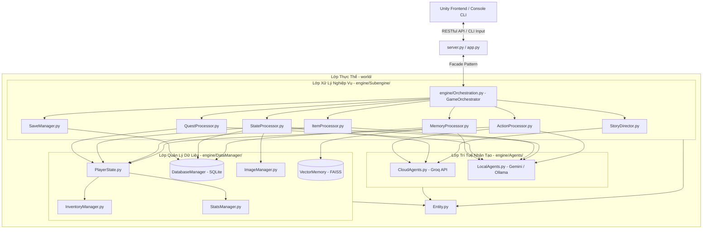
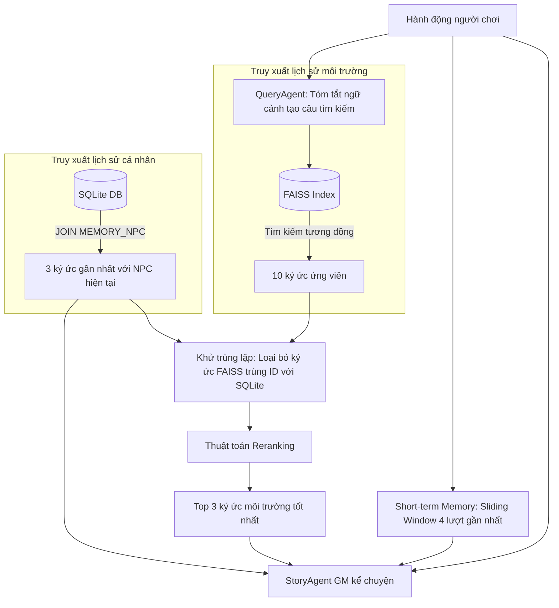
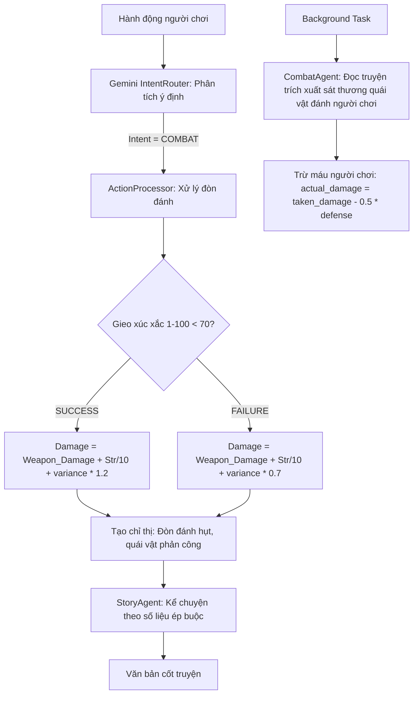
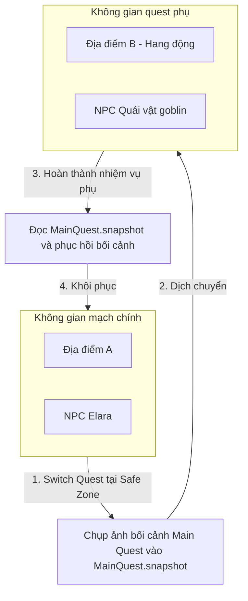

# BẢO VỆ ĐỒ ÁN TOÀN DIỆN: PHÂN TÍCH CẤU TRÚC, KIẾN TRÚC & CAM NANG VẤN ĐÁP
## (Eldoria AI-Story-Adventure Backend Engine)

*Tài liệu phân tích chuyên sâu 360 độ về backend của dự án. Được thiết kế đặc biệt để chuẩn bị cho buổi bảo vệ đồ án, cung cấp từ kiến trúc tổng quan, luồng dữ liệu chi tiết ở mức mã nguồn, đến danh sách 20 câu hỏi vấn đáp trực diện.*

---

## 🏗️ CHƯƠNG 1: TỔNG QUAN KIẾN TRÚC HỆ THỐNG (SYSTEM ARCHITECTURE)

Dự án áp dụng mô hình **Clean Architecture** (Kiến trúc sạch) kết hợp các nguyên lý **SOLID** để phân tách hoàn toàn mã nguồn thành các lớp độc lập. Việc này giúp hệ thống dễ dàng bảo trì, mở rộng và kiểm thử (Unit Test) một cách độc lập mà không bị phụ thuộc vào các API bên ngoài nhờ cơ chế Mocking.



### 1. Phân tích chức năng chi tiết của từng Lớp Thư mục:

*   **`world/Entity.py` (Lớp Thực Thể - Domain Entity Layer)**:
    Nằm ở lõi trong cùng của kiến trúc. Lớp này định nghĩa các thực thể nghiệp vụ căn bản dưới dạng hướng đối tượng (OOP) và Dataclasses. Lớp này hoàn toàn không biết gì về AI, cơ sở dữ liệu hay API. Nó chỉ chứa cấu trúc dữ liệu thuần túy:
    *   `BaseEntity`: Thực thể cơ sở chứa `id`, `name`, `type`, `description`.
    *   `BaseItem`: Kế thừa `BaseEntity` định danh vật phẩm.
    *   `ConsumableItem`: Kế thừa `BaseItem`, bổ sung từ điển `effect` (HP, strength, agility, v.v.).
    *   `WeaponItem`: Kế thừa `BaseItem`, bổ sung `base_damage`, `modifiers`, `status_effect`, và `proc_chance`.
    *   `QuestItem`: Kế thừa `BaseItem`, liên kết trực tiếp với một nhiệm vụ cụ thể (`quest`).
    *   `MiscellaneousItem`: Vật phẩm tạp phẩm dùng làm nguyên liệu chế tạo.
    *   `NPC`: Thực thể nhân vật, quản lý độ thiện cảm (`affectionate`), vị trí (`location`), thể trạng (`status`), và ảnh chân dung (`image_path`).
    *   `Location`: Thực thể bản đồ bối cảnh (`atmosphere`, `image_path`).
    *   `Memory`: Đối tượng dataclass lưu trữ mảnh ký ức phục vụ RAG.
*   **`engine/Agents/` (Lớp Trí tuệ nhân tạo - Agent Infrastructure Layer)**:
    Đóng vai trò là cầu nối với các mô hình ngôn ngữ lớn (LLMs). Được chia làm 2 file:
    *   `CloudAgents.py`: Sử dụng API Cloud (Groq SDK). Quản lý bộ đăng ký token tĩnh (`_turn_token_registry`) để thống kê lượng token sử dụng của mỗi Agent. Chứa các Agent sinh dữ liệu thế giới (`WorldGenerateAgent`), sinh bản đồ (`LocationAgent`), sinh nhân vật (`NPCAgent`), sinh lựa chọn (`ChoiceAgent`), kể chuyện GM (`StoryAgent`), sinh query FAISS (`QueryAgent`), và phân tích combat (`CombatAgent`).
    *   `LocalAgents.py`: Sử dụng Google Gemini API (`gemini-3.1-flash-lite`) hoặc Ollama Local (`gpt-oss:20b-cloud`). Kế thừa `BaseLocalAgent`, hỗ trợ cơ chế tự động tải model ngoại tuyến (`_auto_pull_model_if_missing`). Chứa các bộ trích xuất trạng thái (`StateExtractor`), trích xuất ký ức (`MemoryExtractor`), phân tích nhạc nền (`MusicClassifier`), sinh/đánh giá vật phẩm (`ItemAgent`), và quản lý vòng đời nhiệm vụ (`QuestAgent`).
*   **`engine/DataManager/` (Lớp Quản lý trạng thái và Dữ liệu - Data Gateway Layer)**:
    *   `DatabaseManager.py`: Điều phối luồng đọc/ghi cơ sở dữ liệu SQLite thông qua thư viện `aiosqlite`. Ủy quyền truy vấn cho các quản lý thực thể con (`NPCManager`, `LocationManager`, `MemoryManager`).
    *   `PlayerState.py`: Giữ trạng thái của người chơi trên RAM ở thời gian thực để các phân hệ khác truy xuất với độ trễ cực thấp.
    *   `InventoryManager.py`: Quản lý các hành động thêm, xóa, tìm kiếm vật phẩm và quản lý vũ khí đang trang bị.
    *   `StatsManager.py`: Quản lý máu, giáp và thực thi việc áp dụng các chỉ số cộng thêm từ trang bị (`apply_equipment`) hoặc tiêu thụ (`apply_effect`).
    *   `ImageManager.py`: Quản lý cache và sinh đường dẫn file ảnh. Tên file được băm bằng MD5 (`npc_`, `loc_`, `item_`) để tránh lỗi hệ thống khi chứa chữ tiếng Việt có dấu.
*   **`engine/Subengine/` (Lớp Nghiệp vụ cốt lõi - Business Logic Layer)**:
    Nơi chứa toàn bộ thuật toán điều khiển của trò chơi:
    *   `ActionProcessor.py`: Phân tích ý định (Intent), gieo xúc xắc cơ hội (RNG) và cấu hình combat chỉ thị.
    *   `MemoryProcessor.py`: Thực thi RAG lai, khử trùng lặp và tính toán điểm tái xếp hạng (Reranking).
    *   `StateProcessor.py`: Chạy đa nhiệm trích xuất thay đổi thế giới và cập nhật đồng thời vào CSDL.
    *   `ItemProcessor.py`: Trọng tài chế tạo (Craft) và sử dụng (Use) vật phẩm sáng tạo.
    *   `QuestProcessor.py`: Điều phối chuyển quest, chụp ảnh bối cảnh (`Snapshot`) và nghiệm thu mục tiêu.
    *   `StoryDirector.py`: Quản trò, điều phối luồng streaming và thiết lập thế giới ban đầu.
    *   `SaveManager.py`: Thực hiện quy trình đóng/mở DB và copy đồng bộ dữ liệu vật lý để lưu game.

---

## 🛠️ CHƯƠNG 2: CÁC CÔNG NGHỆ & THƯ VIỆN SỬ DỤNG (TECHNOLOGY STACK DETAILS)

Backend của hệ thống sử dụng các thư viện Python chuyên biệt, hoạt động bất đồng bộ:

### 1. Web API Framework: FastAPI & Uvicorn
*   **FastAPI**: Lựa chọn hàng đầu cho các ứng dụng hiệu năng cao nhờ cơ chế bất đồng bộ (`async/await`) xây dựng trên nền tảng Starlette và Pydantic. Giúp đồng thời xử lý các yêu cầu Polling từ client mà không bị nghẽn luồng.
*   **Uvicorn**: Máy chủ ASGI tốc độ cao, dùng để khởi chạy ứng dụng FastAPI. Trong file `server.py`, server được chạy ở chế độ `reload=False` khi tích hợp với Unity để tránh vòng lặp tiến trình.

### 2. Hệ quản trị Cơ sở dữ liệu: SQLite & aiosqlite
*   **SQLite**: Cơ sở dữ liệu quan hệ cục bộ dạng file, không cần cấu hình máy chủ phức tạp.
*   **aiosqlite**: Wrapper bất đồng bộ cho SQLite, giúp các thao tác truy vấn SQL không chặn luồng chính của FastAPI.
*   **Chế độ WAL (Write-Ahead Logging)**: Được kích hoạt qua câu lệnh `PRAGMA journal_mode=WAL;`. Khi ở chế độ WAL, dữ liệu ghi được ghi vào một file log riêng biệt trước khi đồng bộ vào file `.db` chính. Điều này cho phép nhiều luồng đọc hoạt động đồng thời ngay cả khi có luồng ghi đang chạy.
*   **Khóa ngoại (Foreign Keys)**: Kích hoạt qua `PRAGMA foreign_keys = ON;` để bảo vệ toàn vẹn dữ liệu quan hệ giữa các bảng.

### 3. Tìm kiếm ngữ nghĩa & Nhúng Vector: FAISS & SentenceTransformers
*   **FAISS (Facebook AI Similarity Search)**: Thư viện tối ưu hóa bằng ngôn ngữ C++ giúp tìm kiếm độ tương đồng vector cực nhanh trong không gian nhiều chiều.
*   **SentenceTransformers**: Model `all-MiniLM-L6-v2` nhúng các câu văn bản thành vector 384 chiều (hoặc model `bkai-foundation-models/vietnamese-bi-encoder` trong môi trường CLI). Khoảng cách giữa các vector được tính bằng khoảng cách Cosine hoặc L2 để đo mức độ tương đồng ngữ nghĩa.

### 4. Trình sinh hình ảnh: Stable Diffusion XL (SDXL) via Kaggle & ngrok
*   **SDXL**: Mô hình AI sinh ảnh chất lượng cao. Server SDXL được chạy trên Kaggle (tận dụng GPU miễn phí) và đưa ra internet bằng công cụ tạo tunnel **ngrok**.
*   Backend giao tiếp thông qua lớp `ImageAPI` bằng phương thức HTTP POST chứa FormData (`prompt`, `image_type`, `quality`).

### 5. Phát nhạc nền: Windows MCI (Media Control Interface)
*   Sử dụng hàm hệ thống Windows `mciSendStringW` thông qua thư viện giao tiếp C `ctypes` (`ctypes.windll.winmm`). Phát nhạc bất đồng bộ lặp lại (`play bgm repeat`) và điều chỉnh âm lượng từ `0` đến `1000` (`setaudio bgm volume to ...`) mà không cần cài đặt các thư viện âm thanh nặng của bên thứ ba như Pygame.

---

## 🔄 CHƯƠNG 3: CHI TIẾT CÁC PHÂN HỆ NGHIỆP VỤ & THUẬT TOÁN

### 1. Hệ thống Bộ nhớ RAG Lai (Hybrid RAG Memory)
Hệ thống kết hợp dữ liệu có cấu trúc từ SQLite và dữ liệu phi cấu trúc từ FAISS.



#### Chi tiết Thuật toán Tái xếp hạng (Custom Reranking) trong `MemoryProcessor.py`:
Khi FAISS trả về danh sách 10 ký ức kèm điểm tương đồng (`faiss_scores` nằm trong khoảng $[0, 1]$), hệ thống sẽ tính toán lại điểm số cho từng ký ức dựa trên các yếu tố thời gian và ngữ cảnh:
1.  **Điểm nền tảng**: $S_{\text{base}} = \text{score}_{\text{FAISS}}$
2.  **Hệ số suy giảm thời gian (Time Decay Multiplier)**:
    $$M_{\text{time}} = e^{-0.05 \times \Delta t}$$
    Trong đó $\Delta t = \text{Turn}_{\text{hiện tại}} - \text{Turn}_{\text{ký ức}}$. Nếu ký ức diễn ra cách đây 10 lượt ($\Delta t = 10$), hệ số suy giảm sẽ là $e^{-0.5} \approx 0.606$ (giảm khoảng 40% điểm số).
3.  **Hệ số thưởng ngữ cảnh (Context Bonus)**:
    *   Nếu địa điểm của ký ức trùng khớp với địa điểm hiện tại của người chơi: cộng thêm $0.20$ vào hệ số bonus.
    *   Với mỗi từ khóa của hành động xuất hiện trong nội dung ký ức: cộng thêm $0.15$ vào hệ số bonus.
    *   Hệ số bonus tổng hợp: $M_{\text{bonus}} = 1.0 + \text{Bonus}_{\text{địa điểm}} + \sum \text{Bonus}_{\text{từ khóa}}$.
4.  **Điểm số cuối cùng (Final Score)**:
    $$\text{Score}_{\text{final}} = (S_{\text{base}} \times M_{\text{time}}) \times M_{\text{bonus}}$$
    Ký ức được sắp xếp giảm dần theo điểm số cuối cùng này và lấy ra 3 phần tử tốt nhất.

---

### 2. Hệ thống Chiến đấu & Tính toán RNG (RNG & Combat Mechanics)
Khi người chơi nhập một hành động chiến đấu, hệ thống sẽ thực hiện quy trình xử lý không thông qua LLM để tránh sai lệch:



*   **Tính toán đòn đánh**: Sát thương cơ bản được lấy từ vũ khí đang trang bị (nếu tay không sẽ bằng `Strength / 5`). Điểm bonus bằng `Strength / 10`. Điểm dao động ngẫu nhiên (`variance`) từ $-2$ đến $+3$.
*   **Xử lý đòn đánh thành công/thất bại**:
    *   Nếu gieo xúc xắc thành công ($\le 70$): Sát thương nhân thêm hệ số $1.2$. Chỉ thị ép AI kể chuyện đòn đánh trúng đích.
    *   Nếu gieo xúc xắc thất bại ($> 70$): Sát thương nhân hệ số $0.7$ (sát thương sượt qua hoặc hụt). Chỉ thị ép AI kể chuyện đòn đánh bị né/đỡ và người chơi bị quái vật phản công.
*   **Đồng bộ máu nhân vật**: `CombatAgent` đọc phản hồi cốt truyện để xem người chơi có bị mất máu không. Sát thương quái vật gây ra được trừ đi một nửa điểm phòng thủ (`defense`) của người chơi để ra lượng máu thực tế bị trừ.

---

### 3. Hệ thống Nhiệm vụ & Snapshot Bối cảnh (Quest & Context Snapshot)
Khi người chơi đang thực hiện nhiệm vụ chính (`main_quest`) và kích hoạt một nhiệm vụ phụ (`side_quest`), hệ thống cần đảm bảo không gian của hai nhiệm vụ không bị trộn lẫn:



*   **Lưu Snapshot**: Trong `QuestProcessor.py`, khi chuyển quest, thuộc tính `snapshot` của quest nguồn được ghi đè bằng một từ điển chứa: địa điểm hiện tại (`currentLocation`), bản sao danh sách NPC (`currentNPCs.copy()`), câu chuyện gần nhất và các lựa chọn gần nhất.
*   **Phục hồi Snapshot**: Khi quest đích được chuyển đổi, hệ thống đọc từ thuộc tính `snapshot` của nó và gán ngược lại vào `currentLocation` và `currentNPCs` của `PlayerState`. Nhờ đó, người chơi sẽ quay lại đúng bối cảnh cũ mà AI không bị "râu ông nọ cắm cằm bà kia".

---

## 🗄️ CHƯƠNG 4: THIẾT KẾ CƠ SỞ DỮ LIỆU (DATABASE SCHEMAS)

Hệ thống sử dụng cơ sở dữ liệu quan hệ **SQLite** bao gồm 4 bảng dữ liệu chính:

```mermaid
erDiagram
    Locations ||--o{ NPCs : "has"
    Locations ||--o{ Memory : "happened at"
    NPCs ||--o{ MEMORY_NPC : "linked to"
    Memory ||--o{ MEMORY_NPC : "linked to"
    
    Locations {
        integer location_id PK
        text name UNIQUE
        text description
        text atmosphere
        text image_path
    }
    
    NPCs {
        integer npc_id PK
        text name UNIQUE
        text personality
        text description
        integer affectionate
        text location FK
        text currentStatus
        text image_path
    }
    
    Memory {
        integer memory_id PK
        integer made_at
        text location FK
        text description
        integer gameturn
    }
    
    MEMORY_NPC {
        integer npc_id FK
        integer memory_id FK
    }
```

### Chi tiết các bảng và thuộc tính:
1.  **Bảng `Locations`**: Lưu trữ các địa điểm người chơi từng đi qua để tránh vẽ lại ảnh hoặc tạo lại bối cảnh cũ.
    *   `name`: Tên địa điểm (UNIQUE - dùng làm khóa ngoại cho các bảng khác để dễ truy xuất ngữ nghĩa).
    *   `image_path`: Đường dẫn vật lý đến ảnh nền bối cảnh được lưu trong thư mục save slot.
2.  **Bảng `NPCs`**: Lưu trữ trạng thái nhân vật.
    *   `location`: Tên địa điểm hiện tại của NPC (Foreign Key liên kết tới `Locations.name`).
    *   `affectionate`: Điểm thiện cảm, giới hạn trong khoảng $[-100, 100]$.
    *   `currentStatus`: Trạng thái thể trạng vật lý (Ví dụ: "Bị thương nhẹ", "Bất tỉnh").
3.  **Bảng `Memory`**: Lưu trữ toàn bộ nhật ký tương tác.
    *   `made_at`: Thời gian tạo dạng UNIX timestamp, mặc định bằng `unixepoch()`.
    *   `description`: Nội dung chi tiết của ký ức (ở phiên bản cũ có tên cột là `story`, code tự động kiểm tra cột qua truy vấn PRAGMA để tương thích ngược).
4.  **Bảng `MEMORY_NPC` (Bảng trung gian - Junction Table)**:
    Giải quyết mối quan hệ **nhiều - nhiều (n-n)** giữa Ký ức và NPC. Một lượt chơi có thể có nhiều NPC xuất hiện và một NPC sẽ liên kết với nhiều ký ức. Khóa chính của bảng này là cặp khóa ngoại kép `(npc_id, memory_id)`.

---

## 💬 CHƯƠNG 5: CẤU TRÚC PROMPT ENGINEERING

Các Prompt mẫu được lưu trữ tập trung tại [prompts.yaml](file:///d:/D/HOCTAP/TDTT/AI-Adventure-Game/static/prompts.yaml). Cách tổ chức này giúp lập trình viên chỉnh sửa hướng kể chuyện của AI mà không cần can thiệp vào mã nguồn Python.

### Các biến truyền động chính vào prompt của GM kể chuyện (`StoryAgent`):
Khi gọi hàm kể chuyện, StoryDirector sẽ gộp các thông tin động để thay thế vào prompt thông qua hàm Python `.format()`:
*   `{world_theme}` & `{world_conflict}`: Giới hạn tông màu cốt truyện theo đúng World Bible (Kinh thánh thế giới).
*   `{npc_context}`: Cấp danh sách NPC xung quanh cùng trạng thái thiện cảm để AI đóng vai chuẩn (Ví dụ: thân thiện hay lạnh lùng).
*   `{rag_context}`: Các ký ức dài hạn được lọc từ Vector DB để AI bám sát quá khứ.
*   `{system_directive}`: Lệnh bắt buộc từ code Python (Ví dụ: đòn đánh thành công gây bao nhiêu sát thương, ghép đồ thành công/thất bại).
*   `{active_quest_context}` & `{quest_items}`: Đưa mục tiêu nhiệm vụ hiện tại để AI định hướng gợi mở lối đi cho người chơi.

---

## 🔄 CHƯƠNG 6: CÁC LUỒNG HOẠT ĐỘNG CHI TIẾT (API FLOWS)

### 1. Luồng khởi tạo trò chơi mới (`POST /api/new_game`)
*   **Đầu vào**: Chuỗi văn bản ý tưởng thế giới (`idea`) do người chơi tự nhập.
*   **Quy trình xử lý**:
    1.  Backend dọn dẹp toàn bộ dữ liệu SQLite bằng cách gọi `reset_database()` (thực thi xóa bảng và reset bộ đếm tự tăng trong bảng hệ thống `sqlite_sequence`).
    2.  Xóa toàn bộ các tệp ảnh cache cục bộ trong thư mục NPC, Location, Item.
    3.  `StoryDirector` gọi `WorldGenerateAgent` tạo tệp JSON **World Bible** chứa thông tin cốt lõi (tên thế giới, loại thế giới, xung đột chính, nhiệm vụ và bộ từ vựng độc quyền). Lưu xuống `./data/world_bible.json`.
    4.  Khởi tạo `WorldState` trên RAM từ dữ liệu trên.
    5.  AI tự động thiết kế địa điểm khởi đầu (`create_starting_location`) và 3-5 nhân vật NPC chủ chốt đầu tiên (`initialize_key_npcs`) phù hợp với bối cảnh thế giới.
    6.  `QuestProcessor` khởi tạo chiến dịch cốt truyện chính (`initialize_main_quest`) đặt trạng thái là `in_progress`.
    7.  AI kể đoạn mở màn (Prologue) dạng luồng (Streaming).
    8.  `ChoiceAgent` tạo ra 3 lựa chọn tiếp theo cho người chơi.
    9.  **Tác vụ ngầm (FastAPI Background Task)** được kích hoạt để vẽ ảnh nền địa điểm và ảnh chân dung các NPC xuất phát bằng mô hình SDXL, sau đó lưu vào cache cục bộ.
*   **Đầu ra**: Trả về các phân đoạn câu chuyện (được định dạng speaker bởi `TextFormatter`) và các lựa chọn cho người chơi.

---

### 2. Luồng xử lý lượt chơi (`POST /api/play`)
*   **Đầu vào**: Lựa chọn hoặc hành động tự do của người chơi (`action`).
*   **Quy trình xử lý**:
    1.  `ActionProcessor` phân tích ý định hành động bằng `IntentRouter` để xác định loại hành động (Ví dụ: COMBAT, TALK, MOVE) và gieo xúc xắc xác định thành công/thất bại.
    2.  `MemoryProcessor` thực hiện truy xuất RAG Lai để lấy ký ức liên quan.
    3.  `StoryDirector` gọi `StoryAgent` kể diễn biến tiếp theo (Streaming).
    4.  `ChoiceAgent` tạo 3 lựa chọn mới.
    5.  Hệ thống trả ngay phản hồi (story, choices) về cho Client.
    6.  **Tác vụ ngầm (Background Task) bắt đầu chạy**:
        *   `StateExtractor` phân tích câu chuyện vừa kể xem có thay đổi trạng thái (nhặt đồ, NPC rời đi/đến, chuyển map mới).
        *   Nếu phát hiện map mới hoặc NPC mới, gọi SDXL tạo ảnh và lưu vào cache.
        *   `QuestProcessor` nghiệm thu tiến trình nhiệm vụ hiện hành. Nếu hoàn thành nhiệm vụ phụ, tự động khôi phục bối cảnh nhiệm vụ chính thông qua Snapshot.
        *   `MemoryExtractor` tóm tắt lượt chơi thành một mảnh ký ức (Episode) dạng JSON.
        *   Lưu ký ức vào CSDL SQLite, liên kết ký ức với các NPC xuất hiện trong lượt thông qua bảng trung gian `MEMORY_NPC`.
        *   Đồng thời nhúng vector ký ức đó và đẩy vào Vector DB FAISS.
        *   Đánh dấu bộ đệm dirty cache bằng `True` để báo hiệu dữ liệu đã thay đổi.

---

## ❓ CHƯƠNG 7: BỘ 20 CÂU HỎI VẤN ĐÁP BẢO VỆ ĐỒ ÁN (Q&A)

### Câu 1: Tại sao nhóm lại thiết kế RAG Lai (Hybrid RAG) thay vì dùng mỗi cơ sở dữ liệu Vector?
*   **Trả lời**: Sử dụng duy nhất CSDL Vector để tìm ký ức đôi khi sẽ bị lỗi tìm kiếm tương đồng (bỏ sót các ký ức quan trọng nếu văn bản không dùng từ khóa đồng nghĩa). Bằng cách thiết kế **RAG Lai**:
    - **SQLite** đảm nhận việc truy xuất chính xác 100% các ký ức liên quan trực tiếp đến NPC hiện tại dựa trên mối liên kết khóa ngoại.
    - **FAISS** đảm nhận việc tìm kiếm các ký ức gián tiếp, ký ức môi trường dựa trên ngữ nghĩa của hành động.
    Sự kết hợp này mang lại độ chính xác cao và thông tin bối cảnh phong phú cho AI kể chuyện.

### Câu 2: Thuật toán khử trùng lặp (Deduplication) giữa SQLite và FAISS trong code hoạt động ra sao?
*   **Trả lời**: Trong file [MemoryProcessor.py](file:///d:/D/HOCTAP/TDTT/AI-Adventure-Game/engine/Subengine/MemoryProcessor.py), khi truy vấn ký ức từ SQLite theo NPC hiện tại, hệ thống sẽ lưu các ID của ký ức đó vào tập hợp `personal_memory_ids`. Sau đó, khi tìm kiếm các ký ức tương đồng trên FAISS, hệ thống sẽ duyệt qua các ID kết quả. Bất kỳ ID nào đã có trong `personal_memory_ids` sẽ bị bỏ qua. Việc này giúp tránh nhồi nhét thông tin lặp lại vào ngữ cảnh gửi lên LLM.

### Câu 3: Giải thích chi tiết thuật toán Tái xếp hạng (Reranking) ký ức của nhóm.
*   **Trả lời**: Điểm số của ký ức được tính toán lại theo 3 tiêu chí:
    1.  **Độ tương đồng ngữ nghĩa**: Điểm số ban đầu trả về từ FAISS.
    2.  **Độ tươi mới thời gian**: Nhân điểm số với hệ số suy giảm mũ $e^{-0.05 \times \Delta t}$. Ký ức càng cũ (cách nhiều turn) thì hệ số này càng nhỏ, làm giảm điểm số của nó.
    3.  **Mức độ liên quan bối cảnh**: Nhân thêm hệ số bonus. Nếu ký ức xảy ra tại cùng địa điểm hiện tại, cộng $0.20$ điểm bonus. Với mỗi từ trong đòn đánh của người chơi khớp với ký ức, cộng thêm $0.15$ điểm bonus.
    Cách tính này giúp đưa các ký ức vừa quan trọng về mặt nội dung, vừa gần với hiện tại lên trên cùng.

### Câu 4: AI có tự động cộng trừ máu hay tính sát thương của người chơi không?
*   **Trả lời**: Dạ không. Để đảm bảo game cân bằng và không bị lỗi sinh ảo (hallucination) của AI, toàn bộ logic tính toán chiến đấu đều do code Python đảm nhận qua gieo xúc xắc RNG và công thức toán học cố định. AI chỉ đóng vai trò là người kể chuyện dựa trên số liệu sát thương mà code Python đã chỉ định sẵn trong `system_directive`.

### Câu 5: Hệ thống trích xuất sát thương quái vật gây ra cho người chơi như thế nào để trừ máu?
*   **Trả lời**: Trong các tác vụ ngầm chạy sau lượt đi, hệ thống gọi `CombatAgent` (LLM) đọc câu chuyện GM vừa kể. Agent này có nhiệm vụ duy nhất là phân tích ngữ cảnh và trích xuất ra một số nguyên duy nhất đại diện cho sát thương thô quái vật đánh trúng người chơi (`taken_damage`). Sau đó, code Python của `StatsManager` sẽ nhận giá trị này, giảm trừ đi một nửa chỉ số phòng thủ (`defense`) của người chơi để ra lượng máu bị trừ thực tế.

### Câu 6: Làm thế nào để hệ thống đảm bảo AI không tự tiện kể chuyện người chơi nhặt được vật phẩm thần thoại khi không được phép?
*   **Trả lời**: Trong prompt hệ thống của `StoryAgent`, nhóm thiết lập luật nghiêm ngặt: *Chỉ được sử dụng các vật phẩm có tên trong danh sách 'Quest Items' (vật phẩm nhiệm vụ đang sở hữu) cho phản hồi tiếp theo*. Đồng thời, ở luồng chạy ngầm, `StateExtractor` sẽ kiểm tra chéo xem câu chuyện kể có thực sự phát sinh hành động nhặt đồ hợp lệ không để cập nhật vào túi đồ vật lý. Nếu người chơi cố tình tự viết đòn đánh nhặt được đồ mạnh, AI sẽ bị chỉ thị hệ thống bác bỏ.

### Câu 7: Cơ chế Chụp ảnh bối cảnh (Snapshot) hoạt động ra sao khi chuyển đổi nhiệm vụ?
*   **Trả lời**: Khi người chơi đổi sang làm nhiệm vụ khác:
    1.  Hệ thống chụp lại trạng thái hiện hành bao gồm địa điểm vật lý (`currentLocation`), bản sao danh sách NPC (`currentNPCs`) và câu thoại gần nhất lưu vào thuộc tính `snapshot` của quest cũ.
    2.  Nếu quest mới đã có snapshot từ trước, hệ thống đọc lại snapshot đó để thay đổi giá trị địa điểm và NPC trong `PlayerState` về đúng trạng thái lúc dừng quest đó. Điều này giúp thế giới game không bị hỗn loạn khi người chơi làm nhiều nhiệm vụ song song.

### Câu 8: Tại sao lại cần có điều kiện "Safe Zone" mới cho phép lưu Snapshot và chuyển Quest?
*   **Trả lời**: Nếu cho phép chuyển quest khi đang đứng giữa trận chiến hoặc ở khu vực nguy hiểm, cốt truyện sẽ bị đứt gãy phi logic (ví dụ đang đánh nhau với quỷ vương lại dịch chuyển ngay về làng để nói chuyện với NPC khác). Do đó, hệ thống bắt buộc người chơi phải ở trong `Safe Zone` (khu vực an toàn không có địch) mới cho mở sổ tay chuyển quest và lưu điểm checkpoint.

### Câu 9: Giải thích cơ chế Cache 2 tầng trong API `/api/poll_updates`.
*   **Trả lời**: Tần suất polling từ Unity gửi về backend là rất cao (1 giây một lần). Nếu mỗi lần như vậy backend đều phải đọc file ảnh từ ổ cứng, mã hóa sang chuỗi Base64 và duyệt qua toàn bộ database để lấy túi đồ thì hệ thống sẽ quá tải I/O. Nhóm thiết kế cơ chế:
    - **Heavy Cache (Ảnh bối cảnh, ảnh NPC, túi đồ)**: Chỉ đọc file và mã hóa lại khi biến `dirty` bằng `True` (tức là sau khi có hành động mới vừa chạy xong). Những lần gọi khác chỉ trả về chuỗi Base64 lưu sẵn trong RAM.
    - **Light Data (Máu, chỉ số, cảm xúc)**: Đọc trực tiếp các biến RAM của `PlayerState`, tác vụ này cực kỳ nhanh và nhẹ.

### Câu 10: regular expression (Regex) được dùng ở đâu trong hệ thống và nhằm mục đích gì?
*   **Trả lời**: Regex được sử dụng trong lớp [TextFormatter](file:///d:/D/HOCTAP/TDTT/AI-Adventure-Game/engine/Utils/TextFormatter.py) để tìm các khớp thẻ thoại có cấu trúc dạng `\[(NPC_TALK|PLAYER_TALK)(?::\s*([^\]]*))?\](.*?)\[/\1\]`. Regex giúp bóc tách văn bản thô của AI thành các phân đoạn hội thoại rõ ràng bao gồm tên người nói và lời thoại tương ứng để hiển thị giao diện bong bóng thoại trên Unity.

### Câu 11: Chế độ WAL trong cơ sở dữ liệu SQLite mang lại lợi ích gì cho dự án?
*   **Trả lời**: Chế độ WAL (Write-Ahead Logging) cho phép tiến trình đọc dữ liệu (từ endpoint polling cập nhật giao diện) và tiến trình ghi dữ liệu (từ tác vụ nền ghi ký ức mới vào database) chạy song song bất đồng bộ mà không gây ra lỗi tranh chấp khóa file cơ sở dữ liệu (`sqlite3.OperationalError: database is locked`).

### Câu 12: Tại sao dự án lại phân chia mô hình AI thành Groq (Cloud) và Gemini/Ollama (Local)?
*   **Trả lời**: 
    - **Groq API**: Chạy mô hình `Llama-3.3-70b` trên đám mây để tận dụng tốc độ sinh text cực cao (gần như tức thì), phù hợp cho việc kể cốt truyện dạng luồng (streaming) mượt mà cho người chơi.
    - **Gemini / Ollama**: Chạy các tác vụ xử lý cấu trúc JSON nền (trích xuất state, ký ức). Các tác vụ này không cần quá nhanh nhưng đòi hỏi tính logic và cấu trúc JSON chuẩn xác cao. Việc phân tách giúp tối ưu hóa chi phí API và tăng tốc độ phản hồi tổng thể của game.

### Câu 13: Làm thế nào hệ thống quản lý và dọn dẹp các tệp hình ảnh để tránh đầy bộ nhớ máy?
*   **Trả lời**: Mỗi khi người chơi bắt đầu game mới (`new_game`), hệ thống gọi hàm `clear_image_folders()` để duyệt qua các thư mục ảnh cache (NPC, địa điểm, vật phẩm) và xóa sạch các file ảnh cũ. Tên file ảnh được đặt theo mã băm MD5 dựa trên tên thực thể, giúp tái sử dụng ảnh cũ nếu người chơi quay lại địa điểm cũ mà không cần gọi API sinh lại.

### Câu 14: Tại sao trong file test của dự án lại phải mock SentenceTransformer?
*   **Trả lời**: Model `SentenceTransformer` khi khởi tạo thực tế sẽ tự động tải các file trọng số của mô hình nhúng (dung lượng hàng trăm Megabytes) từ internet về máy và chiếm dụng RAM lớn để tính toán ma trận. Việc Mocking trong [conftest.py](file:///d:/D/HOCTAP/TDTT/AI-Adventure-Game/tests/conftest.py) giúp các ca kiểm thử unit test chạy ngay lập tức bằng cách sinh ngẫu nhiên một mảng số thực giả lập vector mà không cần kết nối mạng hay tải model thật.

### Câu 15: Chức năng của bảng `MEMORY_NPC` trong cơ sở dữ liệu là gì?
*   **Trả lời**: Đây là bảng trung gian dùng để biểu diễn mối quan hệ **Nhiều - Nhiều (Many-to-Many)** giữa bảng `Memory` (Ký ức) và bảng `NPCs` (Nhân vật). Một lượt tương tác có thể có sự hiện diện của nhiều nhân vật và một nhân vật sẽ tham gia vào nhiều ký ức xuyên suốt trò chơi. Việc tách bảng này giúp truy xuất chính xác lịch sử trò chuyện của một NPC cụ thể bằng câu lệnh SQL JOIN.

### Câu 16: Làm thế nào để hệ thống tự động nhận diện người chơi vừa được giao một nhiệm vụ phụ mới từ NPC?
*   **Trả lời**: Ở luồng chạy ngầm của mỗi lượt đi, hệ thống gọi `QuestAgent.evaluate_quest_status`. AI sẽ phân tích hành động người chơi và phản hồi của GM. Nếu phát hiện NPC đề nghị nhờ vả hoặc có một mục tiêu hành động mới xuất hiện, AI sẽ trả về giá trị `"is_new_quest_offered": true`. Hệ thống sẽ lập tức gọi Agent sinh nội dung quest phụ và thêm vào danh sách quest của người chơi.

### Câu 17: Giải thích cơ chế điều phối nhạc nền tự động dựa trên cảm xúc của game.
*   **Trả lời**: Ở tác vụ ngầm, Agent `StateExtractor` phân tích cảm xúc của câu chuyện kể vừa diễn ra và chọn ra một trong các trạng thái: *bình thường, căng thẳng, buồn, vui, sợ hãi*. Giá trị này được gán vào `current_emotion` của Orchestrator. Trình quản lý âm thanh `AudioManager` sẽ so sánh cảm xúc này, nếu có sự thay đổi cảm xúc so với lượt trước, nó sẽ gửi lệnh dừng bản nhạc cũ và phát lặp lại bản nhạc mới thông qua Windows MCI API.

### Câu 18: Lớp `PlayerState` có được đồng bộ trực tiếp xuống database SQLite không? Tại sao?
*   **Trả lời**: Dạ không đồng bộ trực tiếp mọi thuộc tính. `PlayerState` được lưu trên bộ nhớ RAM để đảm bảo tốc độ đọc/ghi cực nhanh khi tính toán chỉ số và chuyển map. Nó chỉ được ghi xuống đĩa cứng thành file JSON `runtime_state.json` khi người chơi thực hiện lưu game (`save_game`) hoặc cập nhật các thông tin cốt lõi (như thông tin NPC, địa điểm mới) vào SQLite để đồng bộ cho RAG.

### Câu 19: Nếu mạng internet bị mất, hệ thống xử lý tính năng vẽ tranh bằng AI như thế nào để game không bị lỗi?
*   **Trả lời**: Trong `ImageAPI.py`, nếu quá trình kết nối tới máy chủ Kaggle thất bại hoặc tính năng vẽ tranh bị tắt động trong cài đặt, hàm `generate_image` sẽ trả về `None`. Khi đó, `ImageManager` sẽ trả về đường dẫn tới ảnh mặc định (`default_location.png` hoặc `default_item.png`) có sẵn trong thư mục tĩnh `static/` giúp game vẫn tiếp tục vận hành bình thường.

### Câu 20: Giải thích quy trình bất đồng bộ chạy song song (Concurrent Tasks) trong `StateProcessor.py`.
*   **Trả lời**: Trong phương thức `process_background_tasks`, hệ thống sử dụng hàm `asyncio.gather` để kích hoạt đồng thời 2 tác vụ: gọi `StateExtractor` trích xuất trạng thái thay đổi và gọi `MemoryExtractor` trích xuất ký ức từ lượt đi. Việc chạy song song này giúp tiết kiệm thời gian chờ phản hồi từ LLM xuống một nửa so với việc gọi tuần tự từng Agent.
